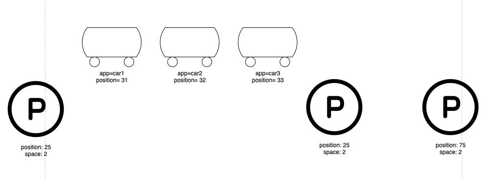
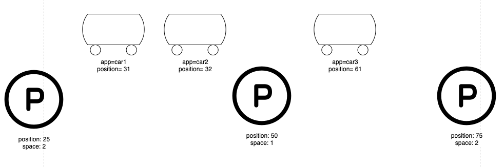
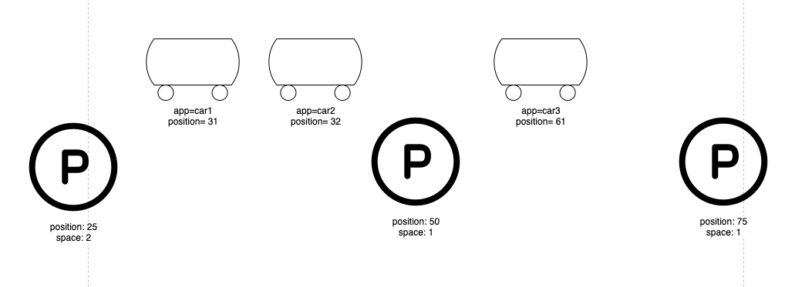

## 策略说明
从位置坐标最大的车辆开始，依次判断每辆车**前方**离自己**最近**的停车场**有无车位**，如果有就停进去， 没有的话继续判断**次近**的停车场。如果没有停车场可用，就提示无法调度。


## 测试用例
**注意，请在tests目录下运行测试代码。**

### 情景一
**Given**: 三辆车都在第1个和第2个停车场中间，三个停车场都还有2个位置
**When**: 执行调度
**Then**: 距离第2个停车场最近的car3/car2被调度到第2个停车场，car1被调度到第3个停车场

运行以下代码测试：
```
./clean.sh

python3 test_1.py

kubectl get pod -o wide
```

### 情景二
**Given**: car1/car2在第1个和第2个停车场中间，car3在第2和第3个停车场中间，第2个停车场还有1个空位， 第3个停车场还有2个空位
**When**: 执行调度
**Then**: car3/car1被调度到第3个停车场， car2被调度到第2个停车场

运行以下代码测试：
```
./clean.sh

python3 test_2.py

kubectl get pod -o wide
```

### 情景三
**Given**: car1/car2在第1个和第2个停车场中间，car3在第2和第3个停车场中间，第2个停车场还有1个空位， 第3个停车场还有1个空位
**When**: 执行调度
**Then**: car3被调度到第3个停车场， car2被调度到第2个停车场, car1无法调度

运行以下代码测试：
```
./clean.sh

python3 test_3.py

kubectl get pod -o wide
```
